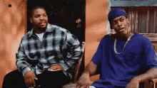
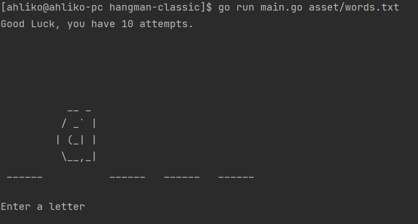
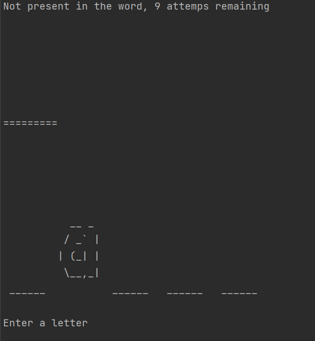
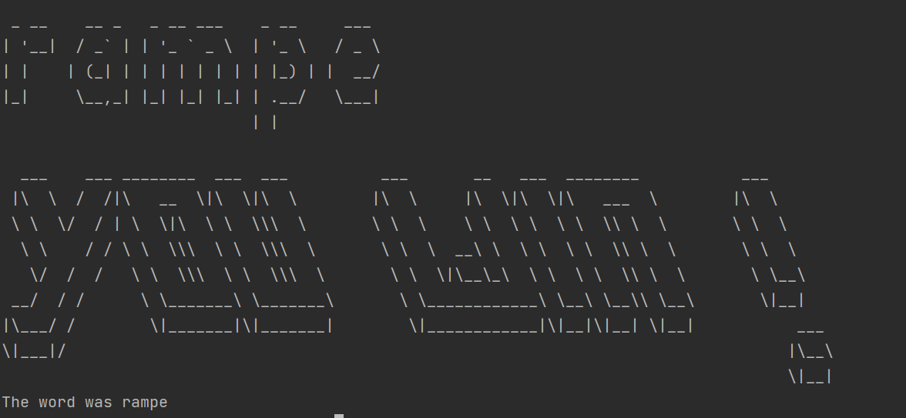
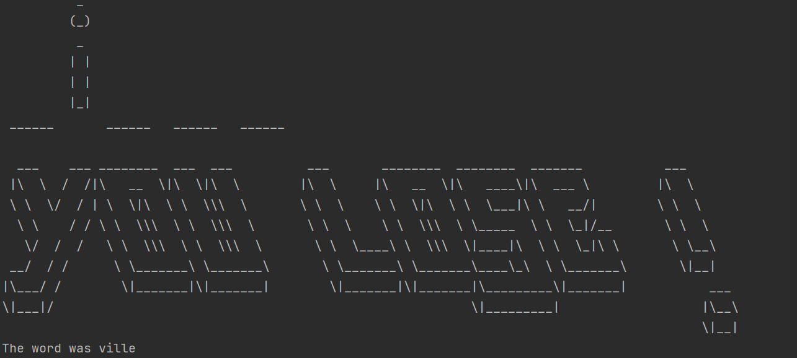

# <div style="text-align: center"> Projet HANGMAN</div>


## Sommaire :

* [Description](#description)
* [La base du projet](#la-base-du-projet)
* [Utilisation](#utilisation)
    * [Installation](#installation)
    * [Lancement](#lancement)
* [Fonctionnalités](#fonctionnalités)
* [Fonctionnalités avancées](#fonctionnalités-avancées-nécessitant-une-commande)
* [Quelques images du jeu](#quelques-images-du-jeu)

## Description :

<div style="text-align: justify"> L'objectif de ce projet est de réaliser un jeu du pendu en Golang. <br>
Le but est de trouver le mot caché en entrant des lettres (ou le mot entier) avec un nombre de tentatives limité. Si le mot contient la lettre entrée, elle est affichée. Sinon, le joueur perd une vie (ou 2 dans le cas du mot) et le dessin d'un pendu se met à apparaît. Le joueur a 10 vies au total. S'il trouve le mot avant de perdre ses 10 vies, il gagne. Sinon, il perd et le dessin est terminé. </div>

## La base du projet :

<div style="text-align: justify"> Le projet se compose de plusieurs parties : </div>
<div style="text-align: justify"> - Le fichier main.go qui contient l'initialisation du jeu. </div>
<div style="text-align: justify"> - Le dossier fonctions qui contient les fonctions du jeu ainsi que le fichier word.go </div>
<div style="text-align: justify"> - Le dossier asset qui contient les fichiers textes contenant les mots utilisés par le jeu, l'ASCII Art du hangman, le fichier les lettres en ASCII Art et un fichier save pour pouvoir sauvegarder sa progression. </div>
<div style="text-align: justify"> - Le fichier start.sh qui permet d'avoir un menu de lancement en CLI</div>

## Utilisation :

### *Installation*

<div style="text-align: justify"> Avant de pouvoir lancer une partie, il faut cloner le repository en local avec la commande suivante : </div>

```bash
git clone <url_du_repository>
```
### *Lancement*

<div style="text-align: justify"> Pour lancer une nouvelle partie, il faut se placer dans le dossier du projet et lancer la commande suivante : </div>

```bash
go run main.go asset/words.txt
```

## Fonctionnalités :

<div style="text-align: justify"> Le programme possède plusieurs fonctionnalités : <br>
- il est capable de gérer les lettres ayant un accent <br>
- il transforme toute les lettres en majuscule pour un esthétique uniforme <br>
- le joueur peut proposer un mot complet ou une lettre (Si le mot est trouvé le jeu s'arrête. Sinon, le compteur de tentatives diminue de 2). (bonus)<br>
- il peut stockez les lettres suggérées par le joueur afin qu'il ne puisse pas proposer deux fois la même lettre. (si c'est le czs un message s'affiche ainsi que la liste des lettres déjà proposées). (bonus) <br>
- Il possède un affichage en Ascii-Art afin de rendre l'expérience de jeu plus agréable. (bonus) </div>


## Fonctionnalités avancées ( nécessitant une commande ) :

<div style="text-align: justify"> Il est possible de sauvegarder une partie afin de la reprendre plus tard. (bonus start-and-stop) <br>
Pour se faire, il faut se placer dans le dossier du projet et lancer la commande suivante pendant le jeu: </div>

```bash
STOP
```

<div style="text-align: justify"> Pour reprendre sa partie, on se place dans le dossier du projet et on lance la commande suivante : </div>

```bash
go run main.go --startWith asset/save.txt
```
<div style="text-align: justify"> Il est possible de lancer une partie en mode hard et d'avoir ainsi plusieurs contraintes : <br>
- nombre de lettres révélées réduit <br>
- pas d'affichage des lettres déjà utilisés par l'utilisateur (si déjà utlisé -1 sur le compteur) <br>
- pouvoir soumettre seulement 3 voyelles (-1 si une voyelle déjà soumise ou si la limite de 3 est dépassée) <br>

Pour se faire, il faut se placer dans le dossier et lancer la commande suivante :</div>

```bash
go run . --hard asset/words.txt
```

<div style="text-align: justify">Un menu de démarrage en CLI, regroupant les fonctionnalités précédentes, est également disponible via cette commande : </div>

```bash
./start.sh
```
## Quelques Images du jeu

<div style="text-align: justify"> Voici quelques images du jeu : </div>

### <div style="text-align: justify"> - Lancement du jeu : </div>



### <div style="text-align: justify"> - Perdre une vie </div>



### <div style="text-align: justify"> - Gagner la partie </div>


### <div style="text-align: justify"> - Perdre la partie </div>


